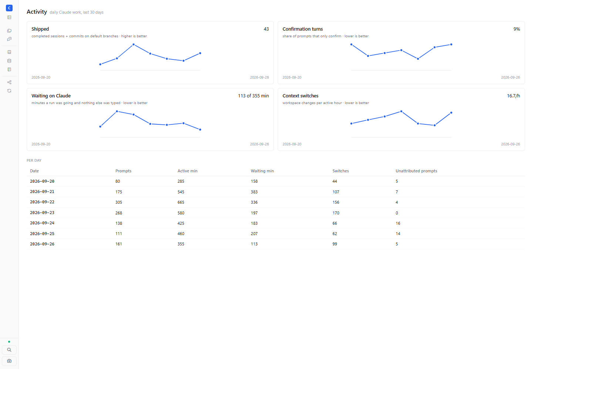

# TASK-2162 — AC verification

Screenshot-verify the Activity view on real digests (carry-forward of TASK-2153 AC-4).
Verified 2026-09-27.

**Result: 1/1 ticked.**

| AC | Verdict | Evidence |
|---|---|---|
| AC-1 | pass | Setup: companion web at main `79172b2`, served by `pnpm --filter web dev` on :5199 and proxied to the live adapter on :7338, with the bridge token injected by the dev proxy. It was opened in Playwright at 1440×1000, and Sync → "Activity" link led to `#/activity`. The screenshot `task-2162-activity-view.png` shows 4 trend charts (Shipped, Confirmation turns, Waiting on Claude, Context switches), each with 7 points for 2026-09-20..26. The 2026-09-25 row shows waiting 207 and switches 62. `data/artifacts/activity/2026-09-25.json` has `waitMinutes 207.1` and `projectSwitches 62` (`switchesPerActiveHour 8.1`). |

The digests are real: `\ChodaActivityDigest` wrote them at 14:06 (TASK-2155), and `GET /activity/digests` returned them with status 200.

## Findings

- **Not the packaged app.** Installed 0.18.1 predates #161, so no released build contains the Activity view.
  The view ran as the companion web against the real adapter and real data, which is the same bundle Electron
  serves, but the packaged path is unproven until the next release (see TASK-2052, un-drafting the update feed).
- **The only console error** was `favicon.ico` 404 from the Vite dev server.
- **Sync ledger shows 3 LWW conflicts on TASK-2162** at 09:29 today ("upsert tasks TASK-2162 dropped by LWW",
  lamport 1785938656 ≤ canonical 1785938657). This is outside this AC, but the task row diverged between laptop
  and remote at creation time.
