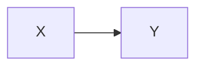
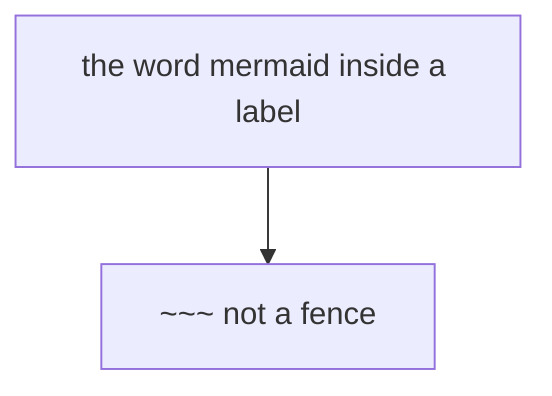

# Fence agreement fixture — TASK-1943

**This file is checked into TWO repositories and must be byte-identical in both.**

- `choda-deck/src/adapters/companion/__fixtures__/fence-agreement.md` (authority)
- `choda-deck-companion/packages/web/src/lib/__fixtures__/fence-agreement.md` (copy)

Both `listMermaidFences` implementations are asserted against it, with the SAME
pinned expectation. The two cannot import each other — different repos, different
runtimes — so this fixture plus its pinned numbers is the only thing that makes a
disagreement between them fail a build instead of silently mis-editing a document.

Every block below is here because it is a case the two could plausibly answer
differently. Do not "tidy" it: the awkwardness is the point.

## 1. A plain fence


## 2. An INDENTED fence

Both sides allow leading whitespace on the marker. A regex written as
/^```mermaid$/ would miss this one and shift every later ordinal by one.

  ```mermaid
  sequenceDiagram
    A->>B: hi
  ```

## 3. A fence with trailing spaces on the marker

The opening marker below has two trailing spaces. A regex anchored straight to
the newline drops it.



## 4. A NON-mermaid fence, which must not be counted

```ts
export const notADiagram = true;
```

## 5. A fence whose BODY contains a line that looks like a marker

The body holds the word `mermaid` and a tilde fence. Neither may open or close
anything — miscounting here changes both the count and the ordinals.



## 6. An empty fence

Zero body lines. A `while` that assumes at least one line can produce an
off-by-one range here.

```mermaid
```

## 7. The last fence, closing at the final line

```mermaid
flowchart TD
  LAST-->ONE
```
